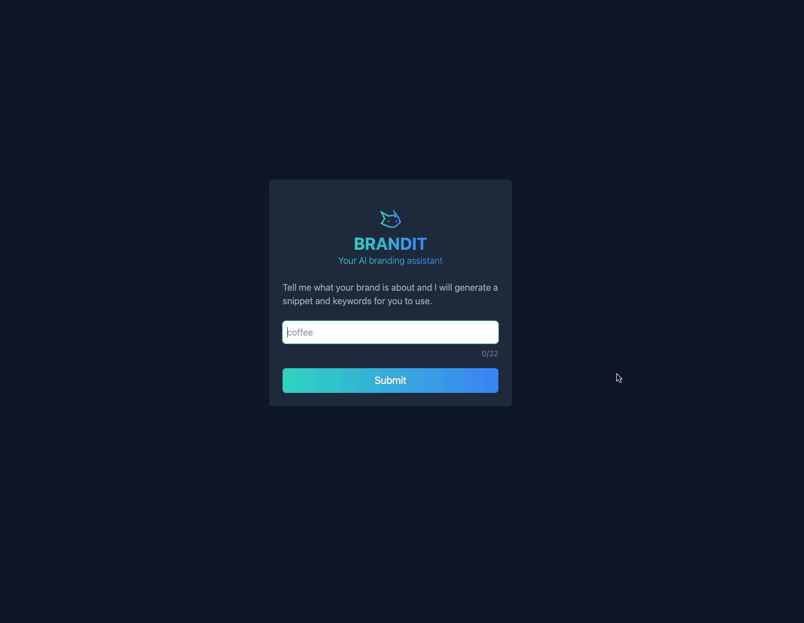
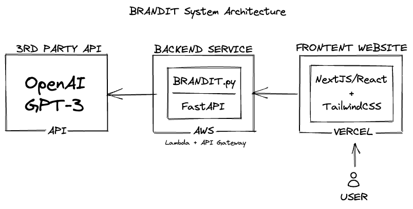
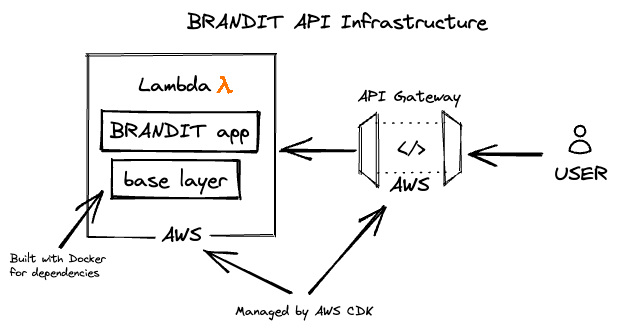

<a id="readme-top"></a>

<!-- PROJECT LOGO -->
<br />
<div align="center">
  <a href="https://brand-ai.vercel.app/">
    
  </a>

  <h3 align="center">BRANDIT</h3>

  <p align="center">
    AI Marketing Assistant
    <br />
    <a href="https://github.com/your_username/BRANDIT/issues/new?labels=bug&template=bug-report---.md">Report Bug</a>
    ·
    <a href="https://github.com/your_username/BRANDIT/issues/new?labels=enhancement&template=feature-request---.md">Request Feature</a>
  </p>
</div>


<!-- ABOUT THE PROJECT -->
## About The Project

BRANDIT is an AI Driven SaaS application utilizing OpenAI's GPT-3 API. BRANDIT assists companies and individuals to find upbeat and trending snippets and keywords to use on social media posts to maximize watchtime and interaction.

Key benefits of using BRANDIT:
* **Efficiency**: Save time by generating engaging social media content effortlessly.
* **Trend Identification**: Stay updated with trending keywords and snippets for higher engagement.
* **Enhanced Interaction**: Increase watchtime and interaction on your social media posts.

<div align='center'>
  


</div>

<p align="right">(<a href="#readme-top">back to top</a>)</p>


### Built With

<div align="center">
  
  
  
  
  
  
  
  
  
  
  
  

</div>

<p align="right">(<a href="#readme-top">back to top</a>)</p>


### Infrastructure

<table>
  <tr>
    <td><p>System Architecture:</p></td>
    <td><p>Restful API Architecture:</p></td>
  </tr>
</table>

<p align="right">(<a href="#readme-top">back to top</a>)</p>


<!-- GETTING STARTED -->
## Getting Started

This section provides instructions on setting up the project locally.
To get a local copy up and running, follow these steps.

### Prerequisites

This project requires npm. You can install npm using the following command:

```sh
npm install npm@latest -g
```

### Installation

1. Clone the repository
   ```sh
   git clone https://github.com/nafisk/brandit
   ```
2. Navigate to the server directory and install python packages
3. Start the server
   ```sh
   python brandai.py
   ```
4. In a new terminal, navigate to the client directory and install NPM packages
   ```
   cd client
   npm install
   ```
5. Start the client
   ```sh
   npm start
   ```

<p align="right">(<a href="#readme-top">back to top</a>)</p>


<!-- ROADMAP -->
## Roadmap

- [x] User authentication and authorization
- [x] Integration with OpenAI's GPT-3 API
- [x] Social media post generation
- [ ] Advanced keyword and snippet search
- [ ] Analytics dashboard for social media performance

See the [open issues](https://github.com/your_username/BRANDIT/issues) for a full list of proposed features (and known issues).

<p align="right">(<a href="#readme-top">back to top</a>)</p>


<!-- CONTRIBUTING -->
## Contributing

Contributions are what make the open-source community such an amazing place to learn, inspire, and create. Any contributions you make are **greatly appreciated**.

If you have a suggestion that would make this project better, please fork the repository and create a pull request. You can also open an issue with the tag "enhancement".
Don't forget to give the project a star! Thanks again!

1. Fork the Project
2. Create your Feature Branch (`git checkout -b feature/AmazingFeature`)
3. Commit your Changes (`git commit -m 'Add some AmazingFeature'`)
4. Push to the Branch (`git push origin feature/AmazingFeature`)
5. Open a Pull Request

<p align="right">(<a href="#readme-top">back to top</a>)</p>


<!-- LICENSE -->
## License

Distributed under the MIT License. See `LICENSE.txt` for more information.

<p align="right">(<a href="#readme-top">back to top</a>)</p>


<!-- CONTACT -->
## Contact

Nafis Khan - [@nafisxk](https://twitter.com/nafisxk) - nafisrizwank@gmail.com
<p align="right">(<a href="#readme-top">back to top</a>)</p>

